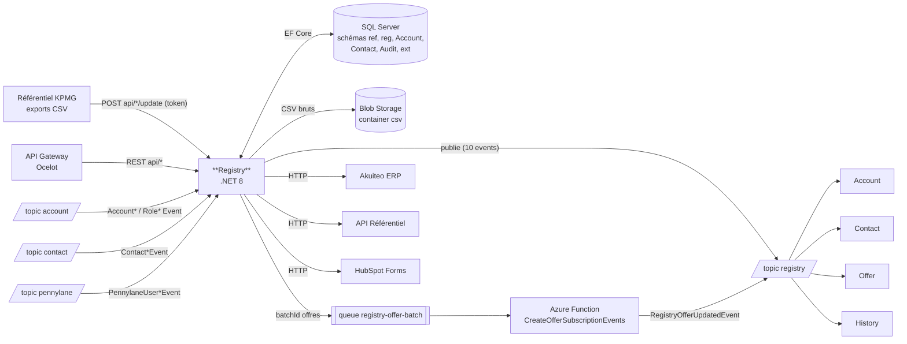

# Pulse.Back.Registry — Architecture & Service Context

> **Document de contexte humain / agent IA.**
> L'inventaire factuel (endpoints, events publiés/consommés, handlers, projets, packages internes)
> est porté par [`architecture.graph.yaml`](./architecture.graph.yaml), **régénéré automatiquement sur `main`**
> par la pipeline ArchGraph, et consolidé dans `pulse.graph.yaml` (topics, subscriptions, consommateurs)
> et `events.catalog.yaml` (payloads des events) côté Pulse.Operations.Review.
> **Ne pas dupliquer ces listes ici** — ce document porte ce que le graphe ne dit pas :
> rôle métier, invariants, points d'attention, règles spécifiques.
>
> Point d'entrée agents : ce fichier (contexte) → le graphe (facts).

---

## 1. Rôle du service

<!-- DRAFT: à relire par l'équipe -->

Le service **Registry** est la **passerelle de synchronisation** entre le **référentiel client externe KPMG** et la plateforme Pulse.
Il gère :

- La **réception des exports CSV** du référentiel (comptes, contacts, rôles, offres) via des endpoints `POST api/*/update` sécurisés par token, avec archivage des CSV bruts en Blob Storage
- Le **calcul des deltas** : les données reçues alimentent les tables `ref.*`, les écarts sont matérialisés en opérations `INSERT` / `UPDATE` / `DELETE` (`reg.Operations`), traitées par un orchestrateur **Hangfire** (contacts → comptes → rôles)
- La **republication vers Pulse** des changements sous forme d'events `Registry*` sur le topic `registry` (consommés par Account, Contact, Offer, History)
- Le maintien de **projections locales** des comptes/contacts/rôles Pulse (alimentées par les events des services Account et Contact) pour comparaison avec le référentiel
- Les **deep validations** (Azure Function durable planifiée) : détection d'écarts entre Pulse et le référentiel, résultats en `Audit.DeepValidations`
- Les intégrations sortantes : **Akuiteo** (création clients/contacts, upload de documents, éligibilité prospects par SIRET), **HubSpot** (soumission de formulaires, notification demat via `HistoryCreatedEvent`), **API Référentiel** (appels authentifiés)
- La **migration des offres** par batch (queue `registry-offer-batch` + Azure Function)

C'est un service **cœur** : il est la source de vérité des données du référentiel KPMG dans Pulse.

### Vue d'ensemble des flux

> Vue synthétique **indicative** — la source de vérité de la topologie est le graphe consolidé `pulse.graph.yaml`.



---

## 2. Données possédées

| Entité | Table (schéma) | Description |
|--------|----------------|-------------|
| `AccountEntity` | `Account.Accounts` | Projection locale des comptes Pulse (alimentée par les events du service Account) |
| `ContactEntity` | `Contact.Contacts` | Projection locale des contacts Pulse (alimentée par les events du service Contact) |
| `DeepValidationEntity` | `Audit.DeepValidations` | Résultats des validations profondes Pulse ↔ référentiel |
| `HubSpotFormEntity` | `ext.HubspotForm` | Suivi des soumissions de formulaires HubSpot |
| `PendingOperationEntity` | vue `PendingOperations` (sans `ToTable`) | Opérations de synchronisation en attente |
| `RefAccountEntity` | `ref.Account` | Comptes reçus du référentiel externe (CSV) |
| `RefContactEntity` | `ref.Contact` | Contacts reçus du référentiel externe (CSV) |
| `RefOfferEntity` | `ref.Offer` | Offres reçues du référentiel externe (CSV, avec `BatchId` de migration) |
| `RefRoleEntity` | `ref.Role` | Rôles reçus du référentiel externe (CSV) |
| `RegOperationEntity` | `reg.Operations` | Opérations de synchronisation (INSERT / UPDATE / DELETE) et leur statut |
| `RoleEntity` | `Account.Roles` | Projection locale des rôles Pulse |

- Base : **SQL Server** (projet SSDT `Registry.Sql.Database`, schémas `Account`, `Archive`, `Audit`, `Contact`, `ext`, `ref`, `reg`)
- Accès : **EF Core** (`Registry.Infrastructure/Context/RefContext.cs`)

---

## 3. API exposée

**Liste exhaustive des endpoints : [`architecture.graph.yaml`](./architecture.graph.yaml)** (section
`managed_by_script.endpoints`). Contrat de référence : **OpenAPI** (Swashbuckle) — `registry/api/v1/api.json`
sur l'instance ; en cas de divergence, l'OpenAPI fait foi.

- Préfixe : `api/`. Principaux domaines : réception CSV référentiel (`api/{account,contact,role,offer}/update` —
  token requis, `api/offer/update` déclenche le batch `registry-offer-batch`), Akuiteo (`api/akuiteo/*`),
  HubSpot (`api/hubspot/*`), opérations de synchro (`api/operations`), éligibilité prospects (`api/prospects/check-eligibility`),
  téléchargement du PDF d'une facture (`GET api/invoices/{invoiceNumber}/accounts/{accountNumber}/content` — pas de
  token, destiné à la Gateway).
- Les endpoints `*/update` sont appelés par le **référentiel externe** et sécurisés par un **token en query string**
  (pas par la Gateway). Les CSV sont reçus en `application/csv` (`PlainTextInputFormatter`).

---

## 4. Events publiés

**Liste de référence : le graphe** (fragment + consolidé, croisés avec `servicebus.yaml` du repo infra —
source de vérité du déploiement). Ce qui suit est le **contexte métier** des publications.

Topic de publication : **`registry`** (via `Pulse.Back.Events`, propriété de filtrage : `EventType`).

| Event | Déclencheur |
|-------|-------------|
| `HistoryCreatedEvent` | Soumission d'un formulaire HubSpot (demat) — `HubSpotEventPublisher` |
| `RegistryAccountCreatedEvent` / `RegistryAccountUpdatedEvent` / `RegistryAccountRemovedEvent` | Orchestrateur Hangfire — opérations INSERT / UPDATE / DELETE compte (`AccountOrchestrator`) |
| `RegistryContactCreatedEvent` / `RegistryContactUpdatedEvent` / `RegistryContactRemovedEvent` | Orchestrateur Hangfire — opérations INSERT / UPDATE / DELETE contact (`ContactOrchestrator`) |
| `RegistryOfferBatchEvent` | `OfferEventPublisher.PublishOfferBatchEventAsync` (**aucun appelant**, voir anomalie) |
| `RegistryOfferUpdatedEvent` | Azure Function `CreateOfferSubscriptionEvents` (batch) + `OfferEventPublisher` |
| `RegistryRoleCreatedEvent` / `RegistryRoleRemovedEvent` | Orchestrateur Hangfire — opérations INSERT / DELETE rôle (`RoleOrchestrator`) |

Message hors event (queue) : `OfferController` envoie le `batchId` des offres sur la **queue `registry-offer-batch`**, consommée par l'Azure Function `CreateOfferSubscriptionEvents` du service lui-même (boucle interne de migration des offres).

⚠️ **Anomalie détectée** : `RegistryOfferBatchEvent` — la méthode `PublishOfferBatchEventAsync` (publication sur le topic `registry`) n'a **aucun appelant** dans le code et **aucune subscription** ne filtre cet `EventType` dans `servicebus.yaml`. Code probablement mort (le flux réel passe par la queue `registry-offer-batch`).

> ⚠️ **Règle anti-régression** : ne jamais supprimer ni renommer un champ d'un event publié
> (breaking change silencieux pour tous les consommateurs, cf. graphe consolidé). Ajout de champ uniquement.
> Toute modification d'un event `Registry*` impacte Account, Contact, Offer et History : les prévenir / tester.

---

## 5. Events consommés

**Liste exhaustive events consommés / handlers : le fragment** (`managed_by_script.events.consumes`) ;
producteurs, topics et subscriptions déployées : graphe consolidé.

- Subscriptions configurées dans `appsettings` (`PullTopics`) ; handlers enregistrés dans
  `Registry.Infrastructure/DependencyInjection.cs` (keyed services par `EventType`).
- Anomalies connues (documentées dans `baseline.yaml` d'ArchGraph) : subscription morte `offer-validated-registry`
  (aucun handler `SubscriptionValidatedEvent` dans le repo — à nettoyer côté infra) ; nommage legacy
  `registry-usercreated-pnl` / `registry-userremoved-pnl` (consommées par Registry malgré le suffixe `-pnl`).
- ℹ️ **Note (voulu)** : les `PullTopics` de `appsettings.json` / `appsettings.Development.json` référencent les
  subscriptions du **service Entity** (`contact-created-entity`, `account-created-entity`, …). C'est **intentionnel** :
  lors de la création de comptes de test (via Entity), l'event émis suit le chemin des données et doit être consommé
  par Registry. Ne pas « corriger » cette config vers `*-registry`.

> Les handlers doivent être **idempotents** (vérifier l'existence avant `AddAsync`) —
> jamais de `catch (Exception) { return; }` (= perte de message).

---

## 6. Dépendances

> Versions des packages internes : fragment (`managed_by_script.internal_packages`).

| Type | Cible | Usage |
|------|-------|-------|
| Base de données | SQL Server (schémas `ref`, `reg`, `Account`, `Contact`, `Audit`, `ext`, `Archive`) | EF Core (+ EFCore.BulkExtensions), projet SSDT `Registry.Sql.Database` |
| Messaging | Azure Service Bus | `Pulse.Back.Events` — push : `registry` ; pull : `account`, `contact`, `pennylane` ; queue : `registry-offer-batch` |
| Stockage | Azure Blob Storage (container `csv`) | Archivage des CSV bruts reçus du référentiel |
| Package Pulse | `Kpmg.ExceptionMiddleware` | Gestion d'erreurs (**legacy**, voir §7) |
| Jobs | Hangfire (**MemoryStorage**) | Orchestration des publications (contacts → comptes → rôles), dashboard exposé |
| Azure Functions | `Registry.AzureFuctions` (isolated worker, Durable Task) | Deep validations planifiées (`RunDeepValidationsDurable`, timer `%RunDeepValidationsDurable_FREQUENCY%`) ; batch offres (`CreateOfferSubscriptionEvents`, trigger queue) |
| Feature flags | ConfigCat (via OpenFeature) | Ex. `isProspectConsumptionEnabled` |
| Observabilité | Azure Monitor OpenTelemetry | Logs structurés, traces (TraceId/SpanId) |
| Résilience | Polly | Retries |
| Identité | Managed Identity (`Azure.Identity`) | Accès Service Bus / Blob selon `ConnectToResourcesViaManagedIdentity` |
| Parsing | CsvHelper | Lecture des exports CSV du référentiel |
| **Appels HTTP sortants** | **Akuiteo** (ERP KPMG) | Clients typés `AkuiteoCustomerProvider` / `AkuiteoContactProvider` / `AkuiteoDocumentProvider` / `AkuiteoEligibilityProvider` — token OAuth client_credentials (Microsoft Entra), mode mock (`Akuiteo:UseMockMode`) |
| | **API Référentiel** (client `RegistryApi`) | Appels authentifiés (headers `X-Client-Id` / `X-Client-Secret` + Bearer via client `ReferentialToken`) — utilisé aussi par les Azure Functions (deep validations) |
| | **HubSpot** (`api.hsforms.com`) | Soumission de formulaires |
| | **Storage des PDF de factures** | `InvoiceBlobProvider` — le blob est lu à l'URL absolue de `ref.Invoice.DocumentPath` (host restreint à `*.blob.core.windows.net`), en Managed Identity (`Storage Blob Data Reader`) |

---

## 7. État migration

| Sujet | État actuel | Cible |
|-------|-------------|-------|
| .NET | **net8.0** (tous projets) | .NET 10 / C# 13 (migration en cours à l'échelle de la plateforme) |
| EF Core | 8.x | EF Core 10 |
| Exceptions | `Kpmg.ExceptionMiddleware` (`UseExceptionMiddleware()` dans `Program.cs`) — `AddProblemDetails()` déjà enregistré mais non branché en handler | `IExceptionHandler` + ProblemDetails (RFC 9457) |
| Hosting model | Minimal hosting (`Program.cs` seul) — conforme | — |
| Jobs | Hangfire MemoryStorage (perte des jobs au redémarrage) | À statuer (persistance ou remplacement) |

---

## 8. Structure & tests

```
08_Registry/Pulse.Back.Registry/
├── src/
│   ├── Registry.Api/            # Controllers, Program, HttpClients (projet Registry.WebApi)
│   ├── Registry.Application/    # Services métier, validations, deep validations, mappers, options
│   ├── Registry.AzureFuctions/  # (sic) Azure Functions : deep validations (durable), batch offres
│   ├── Registry.Domain/         # Entités EF (Accounts, Contacts, Audits, ref*, reg*)
│   ├── Registry.Infrastructure/ # EF Core (RefContext), repositories, orchestrateurs, handlers, Hangfire
│   └── Registry.Sql.Database/   # Projet SSDT (schémas Account, Archive, Audit, Contact, ext, ref, reg)
├── tests/
│   ├── Registry.Application.Tests/
│   ├── Registry.AzureFuctions.Tests/
│   ├── Registry.Infrastructure.Tests/
│   └── Registry.WebApi.Tests/
├── pipelines/                   # CI/CD Azure DevOps (Api, Functions, Sql)
└── _docs/                       # ipaas-akuiteo, tests manuels prospect
```

---

## 9. Règles spécifiques au service

<!-- DRAFT: à relire par l'équipe -->

- Les endpoints `*/update` sont authentifiés par un **token en query string** (config `token`) — ne pas les exposer via la Gateway sans revalider ce mécanisme.
- L'orchestrateur Hangfire impose un **ordre strict** : contacts → comptes → rôles (INSERT), puis UPDATE, puis DELETE — ne pas paralléliser ces étapes (dépendances référentielles).
- `AccountEntity` / `ContactEntity` / `RoleEntity` sont des **projections** alimentées par les events Account/Contact : ne jamais les modifier via l'API.
- Le flag `BackGroundJob:ShouldTriggerEvents` conditionne la publication des events `Registry*` — le désactiver coupe silencieusement la synchro vers Pulse.
- Hangfire utilise **MemoryStorage** : les jobs en cours sont perdus à chaque redémarrage de l'API ; le rejeu s'appuie sur les opérations `reg.Operations` non traitées.
- La queue `registry-process-events` (déclarée dans `servicebus.yaml`) n'est **pas référencée par le code** du repo — voir anomalies §5/§6 avant toute réutilisation.
